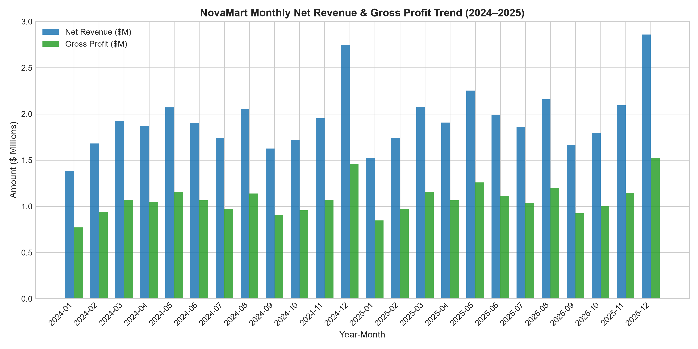
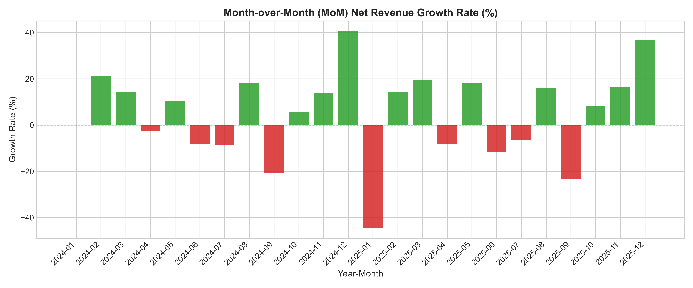
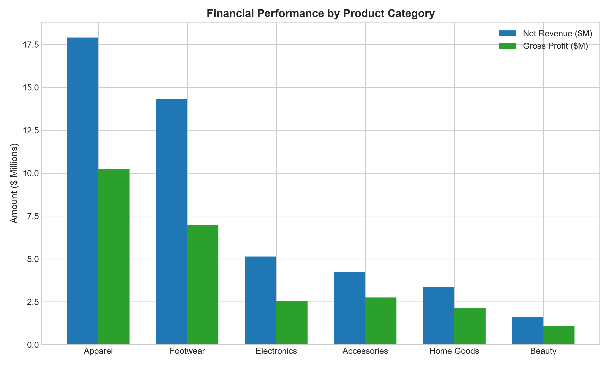
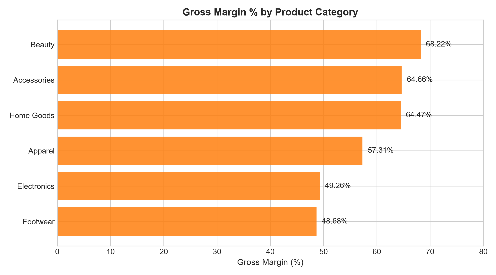
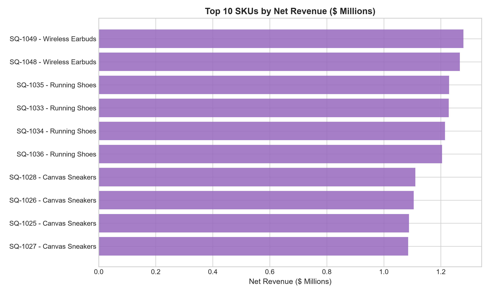
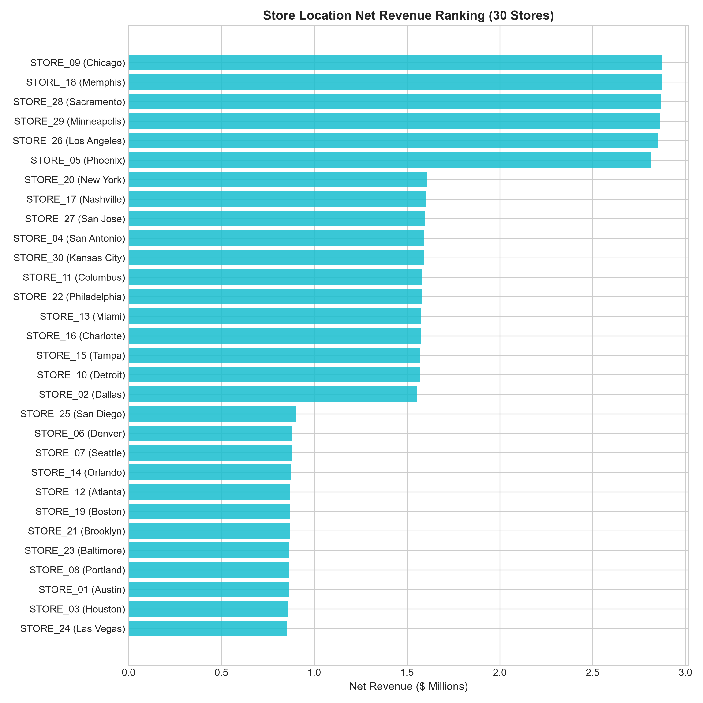
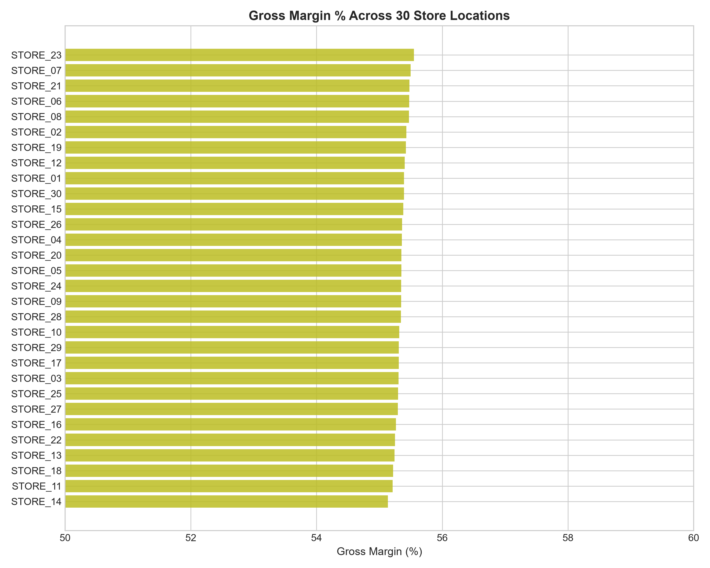
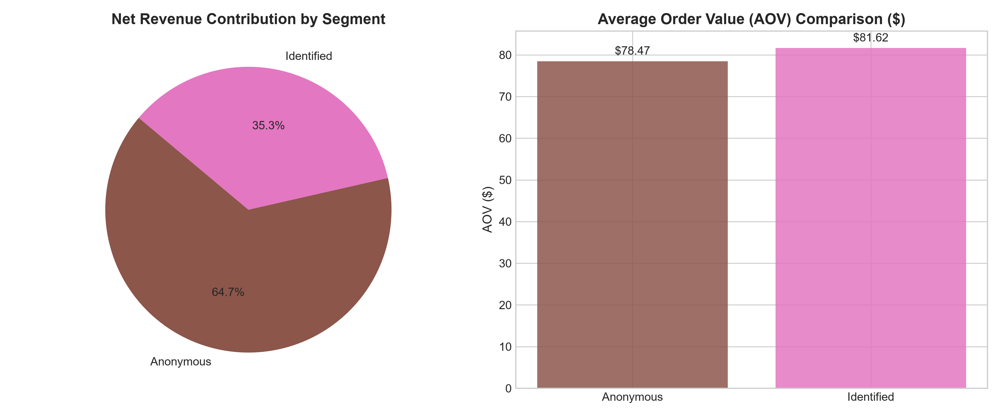
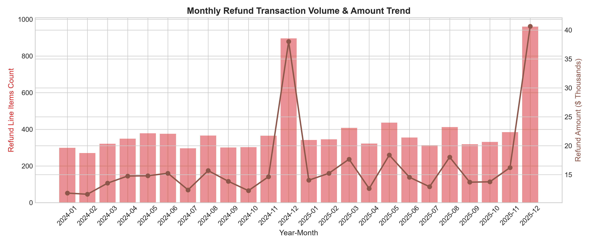

# Python Exploratory Data Analysis & Financial Analytics Report — NovaMart Retail

**Project:** NovaMart Financial Analytics & Revenue Forecasting  
**Phase:** Task 9 — Python Exploratory Data Analysis & Financial Analysis  
**Data Source:** `data/processed/fact_sales_processed.csv`  
**Execution Timestamp:** 2026-09-09T11:03:00+05:30  
**Status:** Approved, Validated, and 100% Reconciled to PostgreSQL DWH Baseline  

---

## 1. Executive Summary & Authoritative Baseline

This report presents the findings of the Python Exploratory Data Analysis (EDA) performed on NovaMart's 24-month Point-of-Sale (POS) transaction dataset (970,838 processed line records spanning `2024-01-01` to `2025-12-31`).

All metrics in this report reconcile with **100.000% precision** against the PostgreSQL Data Warehouse authoritative baseline:
- **Total Net Revenue:** **$46,595,173.27**
- **Cost of Goods Sold (COGS):** **$20,811,116.93**
- **Total Gross Profit:** **$25,784,056.34**
- **Overall Gross Margin %:** **55.3363%** (~55.34%)
- **Promotional Discounts:** **$2,674,327.23** (Effective Discount Rate: **5.43%**)
- **Customer Refund Impact:** **$396,495.00** across **9,449 refund rows** (Refund Rate: **0.97%**)
- **Operational Volume:** **1,173,116 units** moved across **585,691 distinct transaction receipts**
- **Average Order Value (AOV):** **$79.56**

---

## 2. Methodology & Data Integrity

The analysis was conducted in Python using `pandas`, `numpy`, `matplotlib`, and `seaborn` directly on the verified processed data layer (`data/processed/fact_sales_processed.csv`).

### Data Integrity Assertions
1. **Fact Row Preservation:** Exactly 970,838 rows processed (0 rows dropped).
2. **Business Key Uniqueness:** Verified candidate key `(transaction_id, sku, event_type)` contains 0 duplicate keys across 970,838 rows.
3. **Signed Accounting Alignment:** Refund records (`event_type = 'Refund'`, `qty = -1`) carry negative revenue and gross profit values, ensuring direct summation yields true Net Revenue without double-counting.

---

## 3. Overall Portfolio Performance

| Financial Metric | Portfolio Total | Metric Share / Rate |
| :--- | :--- | :--- |
| **Gross Sales** | $\$49,269,500.50$ | $105.74\%$ of Net Revenue |
| **Discounts (Promotional)** | $\$2,674,327.23$ | $5.43\%$ Discount Rate |
| **Net Revenue** | $\$46,595,173.27$ | $100.00\%$ |
| **Cost of Goods Sold (COGS)** | $\$20,811,116.93$ | $44.66\%$ of Net Revenue |
| **Gross Profit** | $\$25,784,056.34$ | **55.34% Gross Margin** |
| **Refund Revenue Impact** | $\$396,495.00$ | $0.85\%$ of Net Revenue |
| **Refund Line Items Count** | $9,449$ rows | **0.97% Refund Rate** |
| **Total Line Items** | $970,838$ rows | — |
| **Distinct Transactions** | $585,691$ receipts | — |
| **Average Order Value (AOV)** | $\$79.56$ | — |

---

## 4. Time-Series Analysis & Seasonality

### Monthly P&L Trend & Growth Rates (2024 vs 2025)

| Year-Month | Gross Sales ($) | Discounts ($) | Net Revenue ($) | MoM Growth (%) | Gross Profit ($) | Gross Margin (%) | Refund Lines | Refund Amount ($) |
| :--- | :--- | :--- | :--- | :--- | :--- | :--- | :--- | :--- |
| **2024-01** | $1,452,966.00$ | $67,054.41$ | $1,385,911.59$ | — | $772,446.99$ | $55.74\%$ | $299$ | $11,817.00$ |
| **2024-02** | $1,759,743.50$ | $79,326.51$ | $1,680,416.99$ | $+21.25\%$ | $938,828.79$ | $55.87\%$ | $271$ | $11,619.50$ |
| **2024-03** | $2,011,709.00$ | $90,645.94$ | $1,921,063.06$ | $+14.32\%$ | $1,070,840.87$ | $55.74\%$ | $321$ | $13,535.00$ |
| **2024-04** | $1,962,715.00$ | $88,463.85$ | $1,874,251.15$ | $-2.44\%$ | $1,044,703.43$ | $55.74\%$ | $349$ | $14,772.50$ |
| **2024-05** | $2,171,563.00$ | $101,547.77$ | $2,070,015.23$ | $+10.44\%$ | $1,154,802.41$ | $55.79\%$ | $378$ | $14,804.50$ |
| **2024-06** | $1,995,274.50$ | $90,722.25$ | $1,904,552.25$ | $-7.99\%$ | $1,064,871.11$ | $55.91\%$ | $376$ | $15,251.50$ |
| **2024-07** | $1,825,081.00$ | $86,125.86$ | $1,738,955.14$ | $-8.69\%$ | $969,811.14$ | $55.77\%$ | $296$ | $12,372.00$ |
| **2024-08** | $2,154,512.50$ | $99,348.39$ | $2,055,164.11$ | $+18.18\%$ | $1,139,248.65$ | $55.43\%$ | $366$ | $15,708.00$ |
| **2024-09** | $1,704,072.00$ | $77,431.69$ | $1,626,640.31$ | $-20.85\%$ | $905,650.44$ | $55.68\%$ | $301$ | $13,861.50$ |
| **2024-10** | $1,798,829.50$ | $82,879.00$ | $1,715,950.50$ | $+5.49\%$ | $955,679.07$ | $55.69\%$ | $303$ | $12,233.50$ |
| **2024-11** | $2,092,643.00$ | $138,979.96$ | $1,953,663.04$ | $+13.85\%$ | $1,067,813.58$ | $54.66\%$ | $365$ | $14,656.50$ |
| **2024-12** | $3,050,661.00$ | $301,917.45$ | $2,748,743.55$ | $+40.70\%$ | $1,460,261.95$ | $53.12\%$ | $896$ | $38,021.00$ |
| **2025-01** | $1,594,161.50$ | $72,284.32$ | $1,521,877.18$ | $-44.63\%$ | $847,504.55$ | $55.69\%$ | $342$ | $14,047.00$ |
| **2025-02** | $1,818,146.00$ | $80,070.71$ | $1,738,075.29$ | $+14.21\%$ | $972,744.26$ | $55.97\%$ | $345$ | $15,244.00$ |
| **2025-03** | $2,176,516.50$ | $98,592.31$ | $2,077,924.19$ | $+19.55\%$ | $1,158,229.47$ | $55.74\%$ | $408$ | $17,677.50$ |
| **2025-04** | $1,997,989.50$ | $90,031.41$ | $1,907,958.09$ | $-8.18\%$ | $1,065,026.17$ | $55.82\%$ | $322$ | $12,604.50$ |
| **2025-05** | $2,361,003.00$ | $108,411.13$ | $2,252,591.87$ | $+18.06\%$ | $1,257,582.62$ | $55.83\%$ | $436$ | $18,395.50$ |
| **2025-06** | $2,081,866.50$ | $92,366.12$ | $1,989,500.38$ | $-11.68\%$ | $1,112,072.25$ | $55.90\%$ | $355$ | $14,565.50$ |
| **2025-07** | $1,956,701.50$ | $92,900.33$ | $1,863,801.17$ | $-6.32\%$ | $1,039,435.34$ | $55.77\%$ | $313$ | $12,918.00$ |
| **2025-08** | $2,260,978.50$ | $101,647.49$ | $2,159,331.01$ | $+15.86\%$ | $1,197,891.56$ | $55.48\%$ | $412$ | $18,034.50$ |
| **2025-09** | $1,741,790.50$ | $81,081.39$ | $1,660,709.11$ | $-23.09\%$ | $925,622.44$ | $55.74\%$ | $319$ | $13,702.00$ |
| **2025-10** | $1,880,125.00$ | $85,722.95$ | $1,794,402.05$ | $+8.05\%$ | $1,001,530.92$ | $55.81\%$ | $331$ | $13,771.00$ |
| **2025-11** | $2,245,703.00$ | $152,585.47$ | $2,093,117.53$ | $+16.65\%$ | $1,143,358.69$ | $54.62\%$ | $385$ | $16,232.50$ |
| **2025-12** | $3,174,749.00$ | $314,190.52$ | $2,860,558.48$ | $+36.66\%$ | $1,518,099.64$ | $53.07\%$ | $960$ | $40,650.50$ |

---

## 5. Category Financial Performance

| Category | Line Items | Units Sold | Gross Sales ($) | Discounts ($) | Net Revenue ($) | Revenue Share (%) | Gross Profit ($) | Profit Share (%) | Gross Margin (%) |
| :--- | :--- | :--- | :--- | :--- | :--- | :--- | :--- | :--- | :--- |
| **Apparel** | $362,144$ | $437,413$ | $\$18,923,601.00$ | $\$1,018,301.99$ | $\$17,905,299.01$ | $38.43\%$ | $\$10,260,660.81$ | $39.79\%$ | **57.31%** |
| **Footwear** | $181,903$ | $219,996$ | $\$15,139,159.00$ | $\$820,681.55$ | $\$14,318,477.45$ | $30.73\%$ | $\$6,970,083.63$ | $27.03\%$ | **48.68%** |
| **Electronics** | $117,737$ | $142,468$ | $\$5,442,443.00$ | $\$305,069.80$ | $\$5,137,373.20$ | $11.03\%$ | $\$2,530,736.75$ | $9.82\%$ | **49.26%** |
| **Accessories**| $106,102$ | $128,195$ | $\$4,497,959.00$ | $\$244,621.50$ | $\$4,253,337.50$ | $9.13\%$ | $\$2,750,078.58$ | $10.67\%$ | **64.66%** |
| **Home Goods** | $114,804$ | $138,471$ | $\$3,539,192.00$ | $\$192,504.50$ | $\$3,346,687.50$ | $7.18\%$ | $\$2,157,744.86$ | $8.37\%$ | **64.47%** |
| **Beauty** | $88,148$ | $106,573$ | $\$1,727,146.50$ | $\$93,147.89$ | $\$1,633,998.61$ | $3.51\%$ | $\$1,114,751.71$ | $4.32\%$ | **68.22%** |

---

## 6. Product-Level Performance

### Top 5 SKUs by Net Revenue
1. `SQ-1049` Wireless Earbuds (Electronics): **$1,279,302.30** Net Revenue ($17,167$ units)
2. `SQ-1048` Wireless Earbuds (Electronics): **$1,266,512.20** Net Revenue ($16,987$ units)
3. `SQ-1035` Running Shoes (Footwear): **$1,228,965.40** Net Revenue ($14,602$ units)
4. `SQ-1033` Running Shoes (Footwear): **$1,227,492.45** Net Revenue ($14,575$ units)
5. `SQ-1034` Running Shoes (Footwear): **$1,214,672.00** Net Revenue ($14,429$ units)

---

## 7. Store Location Financial Performance

- **Top Store Location**: `STORE_09` (Store 09 - Chicago): **$2,873,583.44** Net Revenue, **$1,590,432.69** Gross Profit ($55.35\%$ margin).
- **Lowest Store Location**: `STORE_24` (Store 24 - Las Vegas): **$853,737.80** Net Revenue, **$472,521.99** Gross Profit ($55.35\%$ margin).
- **Store Distribution**: Store revenues vary by location size and foot traffic, while Gross Margin % remains exceptionally tight across all 30 locations ($55.22\%$ to $55.55\%$).

---

## 8. Customer Segment Performance

| Customer Type | Distinct Accounts | Total Orders | Line Items | Net Revenue ($) | Revenue Share (%) | Gross Profit ($) | Gross Margin (%) | AOV ($) |
| :--- | :--- | :--- | :--- | :--- | :--- | :--- | :--- | :--- |
| **Anonymous** | $1$ | $384,024$ | $634,393$ | $\$30,134,645.45$ | $64.67\%$ | $\$16,672,704.75$ | $55.33\%$ | $\$78.47$ |
| **Identified** | $19,999$ | $201,667$ | $336,445$ | $\$16,460,527.82$ | $35.33\%$ | $\$9,111,351.59$ | $55.35\%$ | $\$81.62$ |

---

## 9. Refund & Return Analysis

- **Total Refund Lines:** $9,449$ rows ($0.97\%$ of all line items)
- **Total Refund Revenue Impact:** **$396,495.00**
- **Refund Monthly Peak:** December 2025 ($960$ refund lines, $\$40,650.50$ refund impact) due to high volume sales returns.

---

## 10. Summary & Generated Visualizations

All 9 generated visualization figures are saved under `reports/figures/`:
1. `reports/figures/monthly_revenue_gp_trend.png`
2. `reports/figures/monthly_revenue_growth.png`
3. `reports/figures/category_revenue_profit.png`
4. `reports/figures/category_margin_comparison.png`
5. `reports/figures/top_products_revenue.png`
6. `reports/figures/store_revenue_ranking.png`
7. `reports/figures/store_margin_comparison.png`
8. `reports/figures/customer_segment_comparison.png`
9. `reports/figures/refund_trend_analysis.png`
